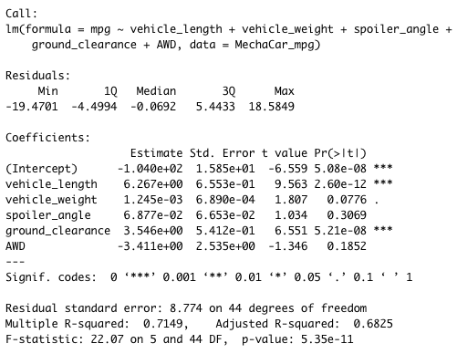

# MechaCar_Statistical_Analysis
Running statistical analysis using R

## Linear Regression to Predict MPG

The Intercept, vehicle_length, and ground_clearance are unlikely to provide random amounts of variance to the linear model. In other words, vehicle length and ground clearance have a significant impact on the mpg. The slope of the linear model should not be considered zero because the p-value of our linear regression analysis is 5.35 x 10-11, which is smaller than our assumed significance level of 0.05%. Therefore, we can state that there is sufficient evidence to reject the null hypothesis, which means that the slope of our linear model is not zero. From our linear regression model, the r-squared value is 0.7149, which means that roughly 71% of all mpg predictions will be correct when using this linear model.

## Summary Statistics on Suspension Coils
### Total Summary

For all manufacturing lots in total, the variance does not exceed 100 pounds per square inch. The summary statistics show the Variance is 62.29 for all manufacturing lots in total.

### Lot Summary

## T-Tests on Suspension Coils

### T-Test for All

Assuming the significance level was the common 0.05 percent, our p-value(.06028) is above the significance level. Therefore, we do not have sufficient evidence to reject the null hypothesis.

### T-Test for Lot 1

Assuming the significance level was the common 0.05 percent, our p-value(1) is higher than the significance level. This p-value represents a normal distribution.

### T-Test for Lot 2

Assuming the significance level was the common 0.05 percent, our p-value(0.6072) is higher than the significance level. Therefore, we do not have sufficient evidence to reject the null hypothesis.

## Study Design: MechaCar vs. Competition

Here, we are comparing how the MechaCar performs against its competition. There are certain metrics that would be of interest to a consumer like cost, city or highway fuel efficiency, horse power, maintenance cost, safety rating, color (The most popular color, according to data provided by iSeeCars.com, is white, followed closely by black. Then gray, then silver). In order to do this we want to answer four different questions which are:

What metric or metrics are you going to test?
The metric that I would like to test is cost. I would be interested in analyzing how competitively does MechaCar price its car by various categories in comparison to their competitors.

What is the null hypothesis or alternative hypothesis?
The null hypothesis is that the researcher's prediction is not true. In this case we would predict that MechaCar has its car similarly priced to its competitors. The alternative hypothesis is that the researcher's predicted difference is true.

What statistical test would you use to test the hypothesis? And why?
In this case we could perform a sample t-test which will give us a way to decide between a null hypothesis and an alternative hypothesis.

What data is needed to run the statistical test?
We would take a sample data with certain features between MechaCar and its competitors to perform a t-test. From the output, we could compare the the p-value for Mechacar and its competitors to see if it is greater than the significance level 0.05 implying that the distribution of the data is not significantly different from normal distribtion. In other words, we can assume the normality and the fact that Mechacar has its vehicle priced similar to its competition.
